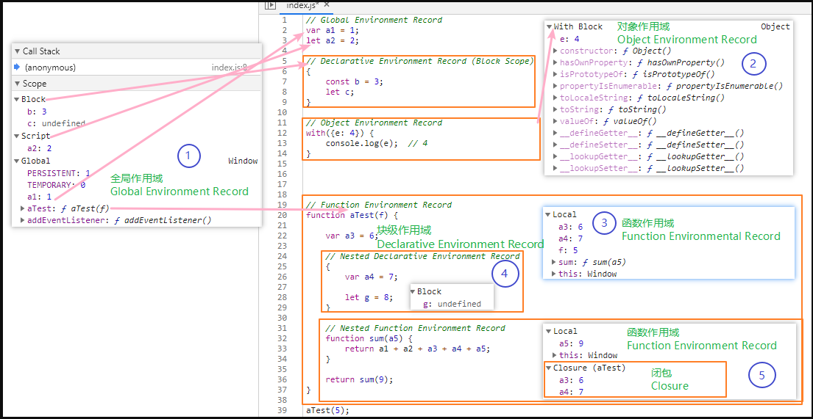

### 概括
本文主要阐述了以下几个问题：
  - 如何理解 `call stack` `Realm`？
  - **执行上下文** 与 **作用域** 的对应关系？
    - 进入 **块级作用域** 需要创建 **执行上下文** 吗？
    - 哪些代码会产生 **执行上下文**，即 **执行上下文** 的分类？
  - **执行上下文** 的主要职责是什么？


### 执行上下文的定义

根据 [ECMAScript 标准](https://tc39.es/ecma262/#sec-execution-contexts) 的描述，程序执行时会创建一个 **运行时执行上下文 (running execution context)** ，用于保存与代码执行相关的一切及执行后的返回地址。**执行上下文** 主要由以下几部分组成：
  - `code evaluation state` 程序的执行状态。
  - `ScriptOrModule` Script 或 Module 源文件，否则为 null (执行函数时) 。
  - `Function` 函数对象，否则为 null (执行 Script 或 Module时) 。
  - `Realm` 代码执行相关的一切，如 JavaScript 语言的内置属性和对象及与平台相关的全局对象。
    - 内置对象：[6.1.7.4 well-known-intrinsic-objects (ES11, 2020)](https://tc39.es/ecma262/#sec-well-known-intrinsic-objects)
    - 全局对象：[18 The Global Object (ES11, 2020)](https://tc39.es/ecma262/#sec-global-object)
    - **顶级作用域中的所有 ECMAScript 代码**及相关的其它资源(如与运行平台相关的额外数据)。
  - 可以看出，执行上下文主要包括两部分：
    - 我们书写的所有 ECMAScript 代码，如 Script、Module 文件；
      - **函数对象** 拥有一个单独的字段，这是因为函数与 Script、Module 等代码均会产生各自的执行上下文；
    - 与语言或平台相关的固有对象：
      - 如 `Object` `String` `window` 等。
  - **注意：**所有代码执行之前，都要先创建一个用于执行代码的独立空间 `Realm`。

    > Before it’s evaluated, all ECMAScript code must be associated with a realm . 
      Conceptually, a realm consists of a set of intrinsic objects, an ECMAScript global environment, all of the ECMAScript code that is loaded within the scope of that global environment, and other associated state and resources.  
    >
    > — [8.2 Realms (ES11, 2020)](https://tc39.es/ecma262/#sec-code-realms).


:::info Realm 的作用

  **Realm** 主要作用就是隔离代码，以便代码可以互不干扰地安全执行。
  `browser tab` `web worker` `iframe` `service worker` 等均拥有自己独立的 Realm 对象。
- Reaml 的更多解析可以参考以下链接：
    - [Realms Explainer — Proposal Realms (TC39)](https://github.com/tc39/proposal-realms/blob/main/explainer.md#VirtualizedEnvironment)
    - [How to understand JS realms — Stack Overflow](https://stackoverflow.com/questions/49832187/how-to-understand-js-realms)

:::


### 执行上下文与作用域

当不是语言或平台的内置对象时，执行上下文的组成还包含相应的 **作用域**，用以下两个字段表示：
  - `LexicalEnvironment` 
  - `VariableEnvironment` 
  - 在大多数情况下两个字段的值相等，只有在以下两种情况下不同：
    - 参数具有默认值时：
      - **参数** 会形成一个独立的作用域，保存在 `VariableEnvironment` 中。
      - 而 **函数体** 顶级作用域中的声明会保存在 `LexicalEnvironment` 中。
    - `eval` 函数：
      - 执行代码中包含默认参数值时，参数声明会保存在 `VariableEnvironment` 中。
      - 在严格模式下运行时：
          - 其它声明则保存在 `LexicalEnvironment` 中。
          - var 和 function 声明会保存在 `VariableEnvironment` 中；
      
      > The eval code can not instantiate variable or function bindings in the variable environment of the calling context that invoked the eval if the calling context is evaluating formal parameter initializers or if either the code of the calling context or the eval code is strict mode code. 
      >
      >**Instead such bindings are instantiated in a new VariableEnvironment that is only accessible to the eval code.** Bindings introduced by let, const, or class declarations are always instantiated in **a new LexicalEnvironment**.
      >
      > — [18.2.1.1  Runtime Semantics: PerformEval ( x, callerRealm, strictCaller, direct ) (ES11, 2021)](https://tc39.es/ecma262/#sec-performeval)


程序运行时，**执行上下文** 会被推入 **栈 ([Call Stack](https://en.wikipedia.org/wiki/Call_stack))** 中(一种先进后出的数据结构)，可以推入多个 **执行上下文**, 但每次只有一个 **执行上下文** 用于执行代码。执行时会从其包含的 **作用域** 中查找变量等与代码执行相关的资源，执行完后会被弹出 **栈**（栈是保存在内存中的一种数据结构，CPU 会从内存中获取相应的数据用于执行）。

> **Only one Job** may be actively undergoing evaluation at any point in time.
>
> Once evaluation of a Job starts, it must **run to completion** before evaluation of any other Job starts.
>
> The abstract closure must return a normal completion, implementing its own handling of errors.
>
> — [8.4  Jobs and Host Operations to Enqueue Jobs© Ecma International 2020](https://tc39.es/ecma262/#sec-jobs)


:::tip Run-To-Completion
使用 **栈** 这种数据结构是因为其符合 JavaScript 语言 **单线程** 及 **run-to-completion** 的设计模式，该模式会确保任务执行完成或报错才会退出。
  - 这样设计的好处是使 JavaScript 语言避免其它强类型语言出现的 **竞态** 问题。
  - 缺点是如果某个任务运行时间过长，可能会使页面响应延迟甚至无法响应，这会给用户带来非常不好的交互体验。
  - 参考
    - [race condition](https://en.wikipedia.org/wiki/Race_condition)
    - [Web Platform Design Principle](https://w3ctag.github.io/design-principles/#js-rtc)
  - 拓展
    - 所以，React 为了改善用户体验，新的 **Reconciliation** 算法内部使用链表 ([Linked List](https://en.wikipedia.org/wiki/Linked_list)) 来替换调用栈 (Call Stack) ，这样做不仅可以**中断、恢复或删除任务**，还可以给不同的任务**分配不同优先级**。
:::


:::note 
 如果你有查看我上一篇文章里提到的 **作用域划分**，你可能会感到困惑，**作用域** 不是划分为五类吗？
 为什么这里只有两个字段用于表示 **作用域** ？**作用域** 与 **执行上下文** 是一一对应的关系吗？
:::


### 执行上下文的分类

其实，从 **执行上下文** 的定义中我们可以看出，大概只有三种情况会产生 **执行上下文**，分别是：
  - `ScriptOrMudule` 
    - **Script** 文件，常称为全局作用域 (规范中称为 Global Environment Record)。
    - **Module** 模块，常称为模块作用域 (规范中称为 Module Environment Record)。
  - `Function`
    - 函数对象，常称为函数作用域 (规范中称为 Function Environment Record)。

:::note
其实还有一种情况也会产生 **执行上下文**，那就是远古时期就已经存在的 `eval` 函数。
:::


### 执行上下文的作用✨

从 **执行上下文的分类** 可以看出还有两类作用域，没有对应的 **执行上下文**，分别是：
  - `Declarative Environment Record` 也就是我们常说的 **块级作用域**。
  - `Object Environment Record` 对应 `with` 语句的作用域。


事实上，**执行上下文** 的最主要作用是**保存代码执行完成后的返回地址**；
  - 因为某些任务可能依赖其它任务的执行结果，而同一时间只能有一个 **执行上下文** 用于执行代码，所以如果没有返回地址，就不能将控制权转移给其它需要执行代码的任务。
  - 如函数的相互调用或执行完函数后返回到全局作用域中执行其它代码。

另一个作用是**保存代码执行的相关资源**。
  - 如函数可能依赖全局作用域中的变量。

如果外界没有相应的引用，**块级作用域** 和 `with` 语句执行后就会被释放。
  - 在外部作用域中访问 `with` 语句中定义的对象：

  ```js
  with({a: 1}) {
    console.log(a); // 1
  }
  console.log(a);   // ReferenceError: a is not defined
  ```

  - 访问声明在块级作用域中的变量
  ```js
  function foo() {
    {
      let a = 1;
    }
    console.log(a) // ReferenceError: a is not defined
  }
  ```

  ```js 
  let a = 1; // 保存在全局作用域中 (Global Environment Record)
  {
    let b = 2;  // 保存在块级作用域中 (Declarative Environment Record)
  }
  console.log(b); // ReferenceError: a is not defined
  ```
**注意**，var 或 function 声明会被提升到全局作用域或函数的顶级作用域中。


:::note

如果块级作用域和对象作用域不创建 **执行上下文** ，那 **执行上下文** 是如何获取这些作用域中的代码并用于执行的呢？

:::


### 执行上下文与作用域切换


事实上，方法很简单，只要引入一个 **临时变量** 就可以，分为以下几步执行：
  - 全局、模块或函数的 **执行上下文** 执行到 **块级语句** 或 `with` 语句时；
  - 将 **执行上下文** 中的 **作用域** 保存到一个临时变量 `oldEnv` 中；
  - 创建一个块级作用域 (newDeclarativeEnvironment)，内部字段 `[[OutEnv]]` 指向其外部作用域 `oldEnv`;
  - 将相应的 `binding` 保存到新创建的**块级作用域**中的；
  - 将 **执行上下文** 的作用域设为新创建的**块级作用域**；
  - 执行块级作用域中的代码并保存其返回值；
  - 将 **执行上下文** 的作用域设回旧的作用域 `oldEnv`；
  - 返回保存的值。

> 1.  Let oldEnv be the running execution context's LexicalEnvironment.
> 2.  Let blockEnv be NewDeclarativeEnvironment(oldEnv).
> 3.  Perform BlockDeclarationInstantiation(StatementList, blockEnv).
> 4.  Set the running execution context's LexicalEnvironment to blockEnv.
> 5.  Let blockValue be the result of evaluating StatementList.
> 6.  Set the running execution context's LexicalEnvironment to oldEnv.
> 7.  Return blockValue.
> — [13.2.13 Runtime Semantics: Evaluation](https://tc39.es/ecma262/#sec-block-runtime-semantics-evaluation)

### 示例




### 拓展

#### 规范中的相应章节

可以按照以下思维图查看作用域与执行上下文的相关内容
  - [代码的编译与执行](https://www.yuque.com/docs/share/eb1f09d6-daa7-43b5-b15d-c8d577d432b6?#)