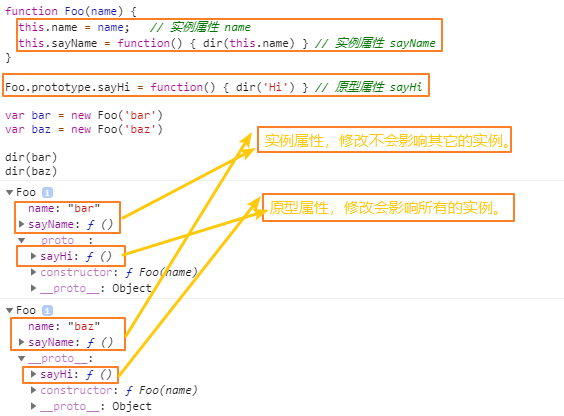
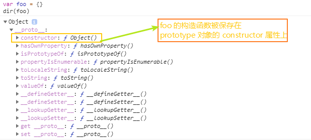

## 概括

本文主要阐述以下几个问题：

  - 继承的含义 ❓
  - 继承的实现方式 ❓
  - 构造函数与普通函数的区别 ❓
  - **new** 运算符的执行过程 ❓
  - **super** 的原理 ❓
  - 实践：`Object.create` 的简易实现。✍

**太长不看**👀：[总结](#总结)


### 继承的定义

想要实现继承，首先要明白继承的含义，在 JavaScript 中，继承是指**对象与对象之间**的继承，主要分为以下两个方面：

  - **原型属性**的继承，继承对象之间的共享属性，修改原型**会**影响到继承该对象的所有对象。
    - `SubClass.[[Prototype]] === SuperClass.prototype`
  - **实例属性**的继承，对象自身的属性，修改实例属性**不会**影响其它的继承对象。
    - 简单来说，实例属性就是除了 **prototype** 属性以外的所有属性。

继承就是将其内部插槽 **[[Prototype]]** 设为父类对象的 **prototype** 属性，然后将其父类对象的 **实例属性** 复制到自身。


### 实例属性的继承

通过 **构造函数** 、`new` 运算符和 `this` 关键字实现 **实例属性** 的继承，原理本文稍后会提到。

```js
function Foo(name) {
  this.name = name;   // 实例属性 name
  this.sayName = function() { dir(this.name) } // 实例属性 sayName
}

Foo.prototype.sayHi = function() { dir('Hi') } // 原型属性 sayHi

var bar = new Foo('bar')  // 实例1
var baz = new Foo('baz')  // 实例2

bar.sayName() // bar
baz.sayName() // baz

bar.sayHi()  // Hi
baz.sayHi()  // Hi

// 修改实例属性并不会影响其它实例
baz.sayName = function() { dir('my name is: ' + this.name) } 

bar.sayName() // bar
bar.sayName() // my name is: baz

// 修改原型属性会影响所有的实例
baz.sayHi = function() { dir('Hello') }

bar.sayHi() // Hello
baz.sayHi() // Hello

```




### 原型属性的隐性继承

当你使用字面量语法如 `var foo = {}` 时，实际上调用的是 `new Object()`，通过该语法创建的对象会自动继承其构造函数的 **prototype** 属性，所以 **foo** 可以调用 `Object.prototype` 的 `toString` `hasOwnProperty` 等方法。


```js
// 使用 new 运算符调用构造函数时，会自动继承构造函数的 prototype 属性
var foo = {} // foo = new Object()

// foo.[[Prototype]] === Object.prototype
foo.__proto__ === Object.prototype  // true
```

> When a constructor creates an object, that object **implicitly references** the **constructor's "prototype"** property for the purpose of resolving property references. 
>
> The **constructor's"prototype"** property can be referenced by the program expression constructor.prototype, and properties added to an object's prototype are shared, through inheritance, by all objects sharing the prototype. 
>
> Alternatively, a new object may be created with an explicitly specified prototype by using the **Object.create** built-in function. 
>
> — [4.3.5  prototype (ES11, 2020)](https://tc39.es/ecma262/#sec-terms-and-definitions-prototype)

简单来说，就是当你使用构造函数 (**constructor**) 创建对象时，会自动继承构造函数的 **prototype** 属性。
  - 伪代码如下：

    ```js
    var someObj = new Consctructor();
    someObj.[[Prototype]] === Constructor.prototype;
    ```

为对象设置 **[[Prototype]]** 的过程可以查看：[从构造函数中获取原型属性](https://www.yuque.com/docs/share/ce262015-85dc-4bc6-9fb4-7af2c59229a8)


### 构造函数的定义


综上所述，原型属性和实例属性的继承都可以通过构造函数实现，**那么什么是构造函数呢？**


- 用于 **创建和初始化** 对象的 **函数对象** 。

  > function object hat **creates** and **initializes** objects. 
  >
  > — [4.4.7 constructor (ES12, 2021)](https://tc39.es/ecma262/#sec-constructor)


#### 与普通函数的区别？

  - 构造函数具有 `[[Construct]]` 内部插槽，普通函数没有。
    - 使用 `new` 运算符调用 **非构造函数** 会报错。

      ```js
      var foo = {
        a() {}
      }
      new foo.a() // TypeError: foo.a is not a constructor.
      ```

  - 函数的调用方法和返回结果不同，包括以下几方面：

    - 普通函数：[[Call]] (thisArgument, argumentsList)
        - `thisArgument`：调用该函数的对象，没有表示全局对象(如 window)。
        - `argumentsList`：参数列表。
        - `newTarget`：值为 **undefined**，表示不使用 `new` 运算符调用。
        - 没有返回值时默认返回 **undefined**。

    - 构造函数：[[Construct]] (argumentsList, newTarget )
        - `thisArgument`：未初始化的 `this` 值。
        - `argumentsList`：参数列表。
        - `newTarget`：值为函数本身，表示使用 `new` 运算符调用。
        - 返回一个由该构造函数创建的新对象。


#### 普通函数与构造函数返回值对比：

```js
// 没有返回值
function Foo1() {}
Foo1()     // undefined
new Foo1() // Object


// 返回原始值 (primitive value)
function Foo2() {
  return 1;
}
Foo2()       // 1
new Foo2()  // Object


// 返回 this 值
function Foo3() {
  return this;
}
Foo3()     // window (browser)
new Foo3() // Object
```


### 构造函数的创建

实际上，JavaScript 中的绝大多数内置对象都是构造函数，如：

  - `Object` `String` `Number` `Boolean` `Date` `Array` `RegExp` ... 。

你可以简单的认为具有 `Prototype` 属性的函数都是构造函数，因为 `prototype` 属性用于继承，而继承的实现依赖构造函数。
哪些函数具有 `prototype` 属性可以查看我的上一篇文章：[原型](./Prototype.md)。


每个对象都可以通过 `obj.constructor` 访问创建它的构造函数，因为 `constructor` 保存在 `prototype` 属性上。示例如下：

```js
var foo = {}  // new Object()
foo.constructor === Object  // true
Object.prototype.constructor === Object // true

// constructor 被保存在 prototype 属性上
foo.hasOwnProperty(constructor)  // false
foo.constructor === Object.prototype.constructor // true
```




`constructor` 在 `function` `class` 和 `DynamicFunction` 的执行阶段生成：

  > — [9.2.5 MakeConstructor (F [,writablePrototype [,prototype ]]) (ES12, 2021)](https://tc39.es/ecma262/#sec-makeconstructor)
  >
  > — [14.1.23  Runtime Semantics: InstantiateFunctionObject (ES12, 2021)](https://tc39.es/ecma262/#sec-function-definitions-runtime-semantics-instantiatefunctionobject)


### 继承的实现原理 (new) ✨


#### 为什么构造函数可以实现继承，而普通函数不可以呢？


因为实现继承的关键并不在于函数本身，而是调用函数的 **new** 运算符。


当使用 `new` 运算符调用构造函数时，会创建一个继承该构造函数的对象。执行过程如下：

  - 创建一个空白对象并将该对象的 **[[Prototype]]** 插槽设为构造函数的 **prototype** 属性；

    > [7.3.1 MakeBasicObject(internalSlotsList) (ES12, 2021)](https://tc39.es/ecma262/#sec-makebasicobject)
    >
    > [9.1.14 GetPrototypeFromConstructor(constructor, intrinsicDefaultProto) (ES12, 2021)](https://tc39.es/ecma262/#sec-getprototypefromconstructor)

  - 将新创建的对象赋值给 `this`；

    - 可以将 `this` 看作是新对象的一个默认引用。
    - 该引用会保存在当前作用域 (函数作用域) 的 **[[ThisValue]]** 插槽中。
    - 这也是为什么你可以在函数中使用 `this` 为对象添加属性的原因。

    > [8.1.1.3.1 BindThisValue(V) (ES12, 2021)](https://tc39.es/ecma262/#sec-bindthisvalue)

  - 使用 `this` 初始化对象的 **实例属性** ，如 `this.name = 'zs'`；
  - 返回 `this` 值。

  ```js
  function ConstructorFunc(name, age) {
    this.name = name;
    this.age = age;
  }
  var obj = new ConstructorFunc('Lisa', 18);

  // 执行 constructorFunc 构造函数的伪代码如下：
  obj = makeBasicObject(internalSlotList);   // 创建一个空白对象
  prototype = GetPrototypeFromConstructor(); // 获取构造函数的 prototype 属性
  obj.[[prototype]] = prototype;             // 继承构造函数的 prototype 属性
  LexicalEnvironment.[[ThisValue]] = obj;    // 将该对象作为 this 值保存到作用域中
  this = LexicalEnvironment.[[ThisValue]];   // 从作用域中获取 this 值并初始化实例属性
  this.name = 'Lisa';
  this.age = 18;
  return this;  // {name: 'Lisa', age: 18}
  ```

**这就是构造函数实现继承的原理：**创建空白对象，继承原型属性，使用 `this` 继承实例属性。


想要了解 `new` 运算符在 ECMAScript 规范中的定义，可以查看以下思维导图：

👉 [new 运算符的执行过程](https://www.yuque.com/docs/share/32fa9303-e78b-4d72-824f-d6ecdd2f2ee3)


### 继承的实现方式

#### 对象的链式继承

与单个对象的继承不同，继承原型链上的多个对象时，需要注意以下几点：

  1. 在子类构造函数中调用父类构造函数，以继承父类构造函数的的 **实例属性** 。

      - 普通构造函数可以通过 `call` `apply` 等方法调用父类构造函数。
      - `class` 类可以通过 `super` 关键字调用父类构造函数。

  2. 通过 `Object.create` 方法继承父类的 **原型属性** (也可以利用构造函数手动实现)。
  
      - **注意**，该方法实际上是将子类的 `prototype` 属性设置为父类构造函数创建的一个全新对象，伪代码如下：

        ```js
        var blankObj = new SuperClass()

        // blankObj.[[Prototype]] = SuperClass.prototype
        blankObj.__proto__ = SuperClass.prototype 

        // SubClass.prototype.[[Prototype]] = blankObj.[[Prototype]]
        SubClass.prototype = blankObj
        ```

      - 注意，此时 **SubClass.prototype** 除了 **[[Prototype]]** 内部属性之外没有任何其它属性。

  3. 为子类构造函数的 `prototype` 对象添加 `Constructor` 属性以用于实例化子类。

      - `SubClass.prototype.constructor = SubClass`

  4. 为子类实例添加共享方法 (即为 SubClass.prototype 添加方法)。
      - `SubClass.prototype.someMethod = function() {}`
      - **注意**，必须继承了父类的原型属性后再添加方法，否则会被覆盖。


#### 示例

```js
// 父类
function Rectangle(x, y) {
  this.x = x;  // 父类实例属性
  this.y = y;  // 父类实例属性
}

// 父类的原型属性
Rectangle.prototype.area = function() { 
  return this.x * this.y;  
}

// 子类
function Cube(x, y, z) {
  Rectangle.call(this, x, y); // 继承父类实例属性
  this.z = z;  // 子类实例属性
}

// 继承父类的原型属性
Cube.prototype = Object.create(Rectangle.prototype); 

Cube.prototype.hasOwnProperty('constructor') // false

// 为 Cube.prototype 添加构造器 (constructor) 属性
// 实例化子类实例时需要使用到子类构造器
Cube.prototype.constructor = Cube;

// 为 Cube.prototype 添加其它属性(共享方法)
Cube.prototype.volume = function() { 
  return this.x * this.y * this.z; 
}

var cube1 = new Cube(1, 2, 3);  // 子类实例1
var cube2 = new Cube(4, 5, 6);  // 子类实例2

cube1.area()   // 2
cube1.volume() // 6

cube2.area()   // 20
cube2.volume() // 120

```


#### Object.create 的简易实现 ✍

了解了构造函数的 **隐性继承**，就可以实现 `Object.create` 的简化版本了。
  - 该实现不支持创建原型为 `null` 的对象。
  - 该实现不支持为创建的对象添加属性及其描述符 ([[Configurable]], ...)。

```js
if (typeof Object.create !== "function") {

    Object.create = function (proto, propertiesObject) {
      
        if (typeof proto !== 'object' && typeof proto !== 'function') {

            // 原型必须是对象类型
            throw new TypeError('Object prototype may only be an Object: ' + proto);

        } else if (proto === null) { 

            // 不支持创建 不继承其它对象 的对象
            throw new Error("not support to create pure(dictionary) object");

        }

        if (typeof propertiesObject != 'undefined') {

            // 不支持为创建的对象添加属性及其描述符
            throw new Error("not support");

        }

        // F 只包含一个用于共享的 prototype 属性，不包括自身使用的属性 (实例属性)
        function F() {}
        F.prototype = proto; 

        // 通过调用构造函数来自动实现原型 (prototype) 继承
        // new F().[[Prototype]] = F.prototype = proto
        return new F();
    };
}
```

#### 手动实现 原型属性 和 实例属性 的继承

```js
/*
@Subclass 子类
@SuperClass 父类
*/
function customInheritance(SubClass, SuperClass) {

  function F() {}  // 空的构造函数
  F.prototype = SuperClass.prototype; // 设置构造函数的原型

  // 利用 new 运算符自动继承构造函数 (F) 的原型属性
  // SubClass.prototype.[[Prototype]] = F.prototype = SuperClass.prototype
  SubClass.prototype = new F();  

  // 为 SubClass 添加 constructor 属性
  SubClass.prototype.constructor = SubClass;

}
```


### Class 继承

```js
class Rectangle {

  constructor(x, y) {  // 不设置会自动生成的构造函数
    this.x = x;  // 实例属性
    this.y = y;  // 实例属性
  }

  // 非静态方法默认会添加到原型上 (Rectangle.prototype) 
  area(x, y) {  
     console.log(this.x * this.y);
  }
}

// 使用 extends 关键字继承父类
class Cube extends Rectangle {

  constructor(x, y, z) {
    super(x, y);  // 使用 super 关键字继承父类实例属性
    this.z = z;   // 子类实例属性
  }

  // 继承且扩展父类方法
  area(x, y) {
    super.area();  // 先调用父类方法，再重写子类逻辑
    console.log('This is SupClass Method.'); 
  }

  // 为子类原型添加共享方法，Cube.prototype.volume
  volume(x, y, z) {  
    return this.x * this.y * this.z;
  }
}

var cube = new Cube(1, 2, 3);  // 实例
cube.area()  // area: 2 (子类可以扩展父类的方法)
```

与强类型语言不同，在 JavaScript 中，`class` 实际上是一个构造函数，必须使用 `new` 运算符调用。


### super 的原理

**注意：**使用 `this` 之前必须在子类构造器中调用 `super`，否则会报 `ReferenceError` 错误，示例如下：

```js
class Rectangle {
  constructor(x, y) {  
    this.x = x;  
    this.y = y;  
  }
}

class Cube extends Rectangle {
  constructor(x, y, z) {
 // super(x, y);  
    this.z = z;  
  }
}

/* 
  ReferenceError: Must call super constructor in derived class 
  before accessing 'this' or returning from derived constructor
*/
var cube = new Cube(1, 2, 3);  
```

这样设计的目的是什么吗？想要理解 `super` 的原理，我们首先查看传统的构造函数是如何 **继承和扩展** 父类的实例属性和原型属性的 👇 。


#### `class` 继承与传统构造函数继承的区别

```js
function Foo(name) {
  this.name = name;
}

function Bar(name, age) {
  Foo.call(this, name);   // 继承父类的实例属性
  this.age = age;
}

var bar = new Bar('Lisa', 18);

```

可以看到，继承实例属性时，需要传递 `this` 值并调用父类构造函数。

实际上，`class` 继承与传统的构造函数继承的最大区别是：**用于初始化对象属性的 `this` 值是否来自于构造函数本身**。

  - 在传统构造函数中，`this` 值为实例化**子类构造函数**时自动创建的一个空白对象。
  - 在 `class` 继承中，`this` 值为**父类构造函数**创建的空白对象 (手动调用 `super`)。


`super` 在子类构造函数 (**constructor**) 中的执行过程大致如下：
  - 通过原型链获取到父级构造函数;
    - 使用 `new` 运算符调用构造函数时，会将其赋值给作用域的 `[[NewTarget]]` 插槽。
    - 执行函数时，会从插槽中取得该构造函数，然后使用 `getPrototypeOf` 获取其父类构造函数。
  - 执行父级构造函数，创建空白对象，初始化父类的实例属性。
  - 将该对象作为 `this` 值绑定到子类作用域中，使用 `this` 初始化子类的实例属性。

  ```js
  class Parent {
    constructor(name) {
      this.name = name;
    }
  }
  class Child extends Parent{
    constructor(name, age) {
      super();
      this.age = age;
    }
  }
  var child = new Child('Lisa', 18); 
  
  // 执行子类构造函数的伪代码如下：
  Environment.[[NewTarget]] = Child;
  Child.[[getPrototypeOf]] = Parent;
  Environment.[[ThisValue]] = new Parent('Lisa'); // {name: 'Lisa'}
  this = Environment.[[ThisValue]];
  this.age = 18; // {name: 'Lisa', age: 18}
  return this;
  ```

详细的执行过程请参考规范文档中的以下章节：

  > [12.3.7 The super Keyword (ES12, 2012)](https://tc39.es/ecma262/#sec-super-keyword)
  >
  > [12.3.7.2 Runtime Semantics: GetSuperConstructor() (ES12, 2012)](https://tc39.es/ecma262/#sec-getsuperconstructor)
  >
  > [7.3.14 Construct (F [, argumentsList [, newTarget]]) (ES12, 2012)](https://tc39.es/ecma262/#sec-construct)
  >
  > [8.1.1.3.1 BindThisValue (V) (ES12, 2012)](https://tc39.es/ecma262/#sec-bindthisvalue)


#### 原型属性的扩展

与实例属性的继承类似，需要在子类原型属性的方法中调用父类原型属性的方法，示例如下：

```js
function Foo(name) {  // 父类
  this.name = name;
}

Foo.prototype.logInfo = function() {  // 父类原型属性的方法
    console.log(this.name);
}

function Bar(name, age) {  // 子类
  Foo.call(this, name);
  this.age = age;
}

// 继承父类的原型属性
Object.setPrototypeOf(Bar.prototype, Foo.prototype);

// 扩展从父类原型中继承的方法
Bar.prototype.logInfo = function() {
// this.__proto__.__proto__.logInfo.call(this);
  Foo.prototype.logInfo.call(this);  // 调用父类方法
  console.log(this.age);  // 扩展继承的父类方法
}

var bar = new Bar('Lisa', 18);
bar.logInfo(); // Lisa 18
```

与示例中通过 `this.__proto__` 或 `call(this)` 等方式调用父类原型属性的方法不同，`class` 继承依靠内部插槽 `[[HomeObject]]` 而不是 `this`。

当对象的属性是符合 [方法定义](https://developer.mozilla.org/en-US/docs/Web/JavaScript/Reference/Functions/Method_definitions) 的函数时，该函数的 `[[HomeObject]]` 插槽会记住该对象，即对象与方法具有绑定关系。

```js
var animal = {
  name: 'animal',
  eat: function() { 
    console.log(this.name);
  }
};

var rabbit = {
  __proto__: animal,  // 继承 animal
  name: 'rabbit',
  eat() { 
    super.eat();  // 调用父类方法
  }
};

rabbit.eat(); // animal or rabbit ??
```

当使用 `super` 调用父类方法时，主要过程如下：
  - 通过函数的 **[[HomeObject]]** 找到当前对象，并获取其父类对象，然后执行父类方法；伪代码如下：

    ```js
    eat.[[HomeObject]] = rabbit;
    rabbit.[[getPrototypeOf]] = animal;
    animal.eat();
    ```

`[[HomeObject]]` 的定义：

  > If the associated function has super property accesses and is not an ArrowFunction, [[HomeObject]] is the object that the function is bound to as a method. The default value for [[HomeObject]] is **undefined**.
  >
  > [8.1.1.3 Function Environment Records (ES12, 2021)](https://tc39.es/ecma262/#sec-function-environment-records)

  > If the function uses super, this is the object whose [[GetPrototypeOf]] provides the object where super property lookups begin.
  >
  > [9.2  ECMAScript Function Objects (ES12, 2021)](https://tc39.es/ecma262/#sec-ecmascript-function-objects)

普通函数的 `[[HomeObject]]` 为 **undefined** ：
  > [9.2.3 OrdinaryFunctionCreate (functionPrototype, ParameterList, Body, thisMode, Scope) (ES12, 2021)](https://tc39.es/ecma262/#sec-ordinaryfunctioncreate)

符合方法定义的函数的 `[[HomeObject]]` 为对象：
  > [9.2.7 MakeMethod (F, homeObject) (ES12, 2021)](https://tc39.es/ecma262/#sec-makemethod)


`[[HomeObject]]` 和 `this` 都是用于执行函数时确认调用对象，区别请看下一篇：[this](./This.md)。


### 巩固练习 📝

```js
class A {}
class B extends A {}
var a = new A()
var b = new B()

a.proto  // ?
B.__proto__ === A // ?       
b.__proto__ === B.prototype // ??
B.prototype.__proto__ === A.prototype  // ?
b.__proto__.__proto__ === A.prototype  // ?
```


## 总结

- 在 JavaScript 中，继承是指**对象与对象之间**的继承，主要包括以下两方面：
  - 原型属性的继承，原型链上的共享属性，修改会影响其它的实例。
  - 实例属性的继承，在子类构造函数中调用父类构造函数，修改不会影响其它实例。
- **可以通过以下方式实现继承：**
  - `Object.create`
  - `Object.setPrototypeOf`
  - `class`
  - `__proto__`
  - 利用构造函数手动实现。
- **构造函数与普通函数具有以下区别：**
  - `this` 的取值。
  - 函数作为方法使用时一般直接调用，作为构造函数使用时要使用 `new` 运算符。
    - 可以使用 `new.target` 判断是否使用了 `new` 运算符。
    - 使用时值为**构造函数本身**，不使用时值为 **undefined**。
  - 返回值不同。
- **`new` 运算符调用构造函数的执行过程：**
  - 创建一个继承构造函数原型的对象。
  - 将 `this` 值设为该对象。
  - 通过 `this` 设置对象的实例属性，如 `this.name = name`
  - 返回 `this`，即第一步中创建的对象。
- **`super` 的执行过程：**
  - 实例属性的继承：
    - 通过 `[[NewTarget]]` 获取当前对象。
    - 通过 `[[GetPrototypeOf]]` 获取父类对象的原型属性。
    - 执行父类对象的构造函数 (**constructor**)。
    - 执行子类对象的构造函数 (**constructor**)。
  - 原型属性的继承：
    - 通过 `[[HomeObject]]` 获取当前对象。
    - 通过 `[[GetPrototypeOf]]` 获取父类对象的原型属性。
    - 执行父类对象的原型属性。
    - 执行子类对象的原型属性。

## 参考

> [__proto__ in ECMAScript 6 -- 2ality](https://2ality.com/2015/09/proto-es6.html)
>
> [Class inheritance -- javascript.info](https://javascript.info/class-inheritance#overriding-constructor)
>
> [Prototypes, inheritance -- javascript.info](https://javascript.info/prototypes)
>
> [进阶必读：深入理解 JavaScript 原型 -- 工业聚](https://zhuanlan.zhihu.com/p/87667349)