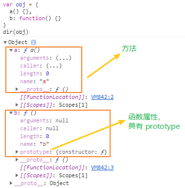
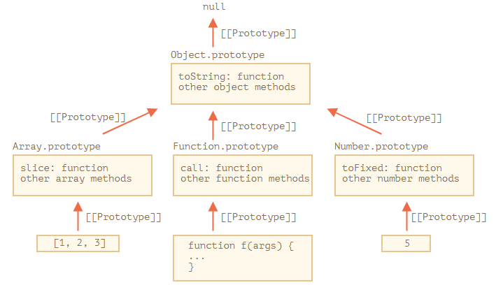
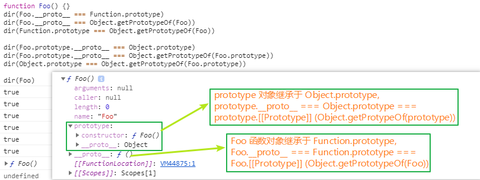

## 概括

本文主要阐述以下几个问题：

  - 原型及原型链的作用 ❓
  - 所有函数都具有原型 (**prototype**) 属性吗 ❓
  - `prototype`, `[[Prototype]]`, `__proto__` 的关联 ❓
  - **实践：** `__proto__` 的实现。✍

**太长不看**👀：[总结](#总结)


### 原型的定义

给其它对象 **提供共享属性** 的 **对象**。

  > **object** that provides shared properties for other objects 
  >
  > — [4.4.8 prototype (ES11, 2020)](https://tc39.es/ecma262/#sec-terms-and-definitions-prototype)


### 原型的创建

对于使用 **函数声明** 或 **函数表达式** 定义的每个函数，都会自动创建原型 (prototype) 属性，以允许将该函数作为构造函数使用 (构造函数可用于实现[继承](./Inheritance.md))。

  >  **"prototype"** property is automatically created for every function defined using a *FunctionDeclaration* or *FunctionExpression*, to allow for the possibility that the function will be used as a constructor.
  >
  > — [14.1.25 Runtime Semantics: Evaluation (ES11, 2020)](https://tc39.es/ecma262/#sec-function-definitions-runtime-semantics-evaluation)


#### 所有函数都具有 prototype 属性吗？

显然不是，根据原型的定义，原型主要用于**提供共享属性**，当函数作为 **方法** 使用时，具有 prototype 属性并没有什么意义。但是在 JavaScript 中，除了以下提到的几种特殊函数以外，大多数函数是默认具有 **prototype** 属性的，即你可以将函数作为 **方法** 使用，也可以将函数作为 **构造器** 使用。


#### 不具有原型属性的函数：

  - 从 ECMAScript 2015 (ES6) 开始，明确了对 **方法** 的定义，与函数属性不同，它不具有 `prototype` 属性。— [Method definitions -- MDN](https://developer.mozilla.org/en-US/docs/Web/JavaScript/Reference/Functions/Method_definitions)
    ```js
    var obj = {
      a() {},   // 方法
      b: function() {}  // (函数)属性
    }
    obj.a.hasOwnProperty('prototype') // false
    new obj.a() // TypeError，方法不能作为构造函数使用
    ```

    


  - JavaScript 语言内置的全局工具函数，如：
    - `eval` `isFinite` `isNaN` `parseFloat` `parseInt`
    - `decodeURI` `decodeURIComponent` `encodeURI` `encodeURIComponent`
     
      > — [18.2 Function Properties of the Global Object (ES12, 2021)](https://tc39.es/ecma262/#sec-function-properties-of-the-global-object)

  - 异步函数、箭头函数、异步箭头函数、异步生成器函数。
    - `async function` `arrow function` `async arrow function` `async generator function`

      > AsyncFunction instances are not constructors and do not have a [[Construct]] internal method. AsyncFunction instances do not have a **prototype** property as they are not constructable. 
      >
      > — [25.7.4 AsyncFunction Instances ( ES12, 2021)](https://tc39.es/ecma262/#sec-async-function-instances)

  - 内置对象的 prototype 属性中的共享方法，如：
    - `Object.prototype.toString`
    - `Array.prototype.join`
    - `String.prototype.trim`
    - ...
    
      > Function objects created using Function.prototype.bind, or by evaluating a MethodDefinition (that is not a GeneratorMethod or AsyncGeneratorMethod) or an ArrowFunction do not have a **"prototype"** property.  
      >
      > — [19.2.4.3  prototype (ES12, 2021)](https://tc39.es/ecma262/#sec-function-instances-prototype)


#### 具有原型属性的构造函数：

- JavaScript 语言内置的函数对象
  - `Object` `String` `Number` `Boolean` `Symbol` `BigInt`
  - `Array` `Date` `Error` `Promise` `Proxy` `RegExp` `Function`
  - `Map` `Set` `WeakMap` `WeakSet` `Int8Array` ...
  
    > — [18.3 Constructor Properties of the Global Object (ES12, 2021)](https://tc39.es/ecma262/#sec-constructor-properties-of-the-global-object)

- 其它常见的函数：
  - 语法糖函数： `class`
  - `function` `generator function` `async generator function` `obj.method`


### 原型的存储：`[[Prototype]]`

所有常规对象 (ordinary objects) 都具有 `[[Prototype]]` 内部插槽，其值为 `Object` 或 `null`，该插槽用于实现继承。

  > All ordinary objects have an internal slot called [[Prototype]]. The value of this internal slot is either **null** or **an object** and is used for implementing inheritance. 
  >
  > — [9.1  Ordinary Object Internal Methods and Internal Slots](https://tc39.es/ecma262/#sec-ordinary-object-internal-methods-and-internal-slots)


#### `Prototype` 与 `[[Prototype]]` 的关联

  - 拥有 `prototype` 属性表示可以被其它对象继承，
  - 拥有 `[[Prototype]]` 内部插槽则表示继承了其它对象的 **prototype** 属性。
  - 可以将 `[[Prototype]]` 看作是 `prototype` 的一个引用。

事实上，在 JavaScript 中，几乎所有的对象都继承于其它对象，即都拥有 [[Prototype]] 内部插槽。
  - 当然，你可以使用 `Object.create(null)` 来创建一个没有继承其它对象的对象。


### 原型链及其作用
 
```js
var arr = [1, 3, 2]

// arr.[[Prototype]] === Array.prototype
Object.getPrototypeOf(arr) === Array.prototype  //true

// Array.prototype.[[Prototype]] === Object.prototype
// arr.[[Prototype]].[[Prototype]] === Object.prototype
Object.getPrototypeOf(Array.prototype) === Object.prototype //true

// 使用 Array.prototype 中的共享方法
arr.concat(4, 7) // [1, 3, 2, 4, 7]

// 使用 Object.prototype 中的共享方法
arr.hasOwnProperty('2')  // true
```

从示例可以看出，**原型链**是指：通过 `[[Prototype]]` 内部插槽连接起来的一系列 prototype 属性。
  - 当对象本身不具有某个属性时，会从 **原型链** 的共享属性中查找。

通过 `[[Prototype]]` ，数组 arr 即可以使用 **Array.prototype** 属性中 `filter` `join` 等共享方法，又可以使用 **Object.prototype** 中的 `hasOwnProperty` 等共享方法。




以上图片来自于： [Native prototypes -- javscript.info](https://javascript.info/native-prototypes)


:::info ***原型链*** 与***作用域链*** 的区别？
通过对 **原型** 和 [作用域](./Closure.md) 的深入理解，我们可以发现：
  - ***作用域链*** 用于查找 **‘变量’** ;
  - ***原型链*** 用于查找 **‘变量上的属性’** ；
:::


### 原型的访问：`__proto__`

在 ECMAScript (ES1 ~ ES3, 1997, 1998, 1999) 的早期版本中 ，并没有定义用于访问 **[[Prototype]]** 内部插槽的方法，所以浏览器实现了一个非标准的 `__proto__` 方法用于访问和设置 **[[Prototype]]**。由于该方法的广泛使用，最终在 ES6 (ES2015) 中将其添加到 `Object.prototype` 属性上。

  > `__proto__` is a way to access [[Prototype]], it is not [[Prototype]] itself.
  > 
  > `__proto__` is not a property of an object, but an accessor property of Object.prototype. 
  > 
  > — [B.3.1  __proto__ Property Names in Object (ES12, 2021)](https://tc39.es/ecma262/#sec-__proto__-property-names-in-object-initializers)


#### 示例1: `__proto__` === [[Prototype]] === prototype

```js
// [1].__proto__ === [1].[[Prototype]] === Array.prototype
[1].__proto__ === Array.prototype              // true
[1].__proto__ === Object.getPrototypeOf([1])   // true
Array.prototype === Object.getPrototypeOf([1]) // true
```


#### 示例2：对象及其 prototype 属性的继承

```js
function Foo() {}

// Foo 函数自身继承于 Function.prototype
dir(Foo.__proto__ === Function.prototype)           // true
dir(Foo.__proto__ === Object.getPrototypeOf(Foo))      // true
dir(Function.prototype === Object.getPrototypeOf(Foo))    // true

// Foo.prototype 对象继承于 Object.prototype
dir(Foo.prototype.__proto__ === Object.prototype)                 // true
dir(Object.prototype === Object.getPrototypeOf(Foo.prototype))        // true
dir(Foo.prototype.__proto__ === Object.getPrototypeOf(Foo.prototype))   // true
``` 
  



#### `__proto__` 的实现 ✍

为什么需要 `__proto__` 方法，直接访问和更改对象的 prototype 属性不行吗？

- 因为设置 prototype 属性往往涉及到更多的操作，例如：
  - 检查 prototype 属性是否为 `undefined` 或 `null`；
  - 判断是否在对象上设置 prototype 属性等。

而 `__proto__` 的设计使其可以在设置原型前对其进行检测，因为 `__proto__` 是访问器属性 (Accessor Properties)。

```js
Object.defineProperty(Object.prototype, '__proto__', {
    get() {
        let _thisObj = Object(this);
        return Object.getPrototypeOf(_thisObj);
    },
    set(proto) {
        if (this === undefined || this === null) {
            throw new TypeError();
        }
        if (!isObject(this)) {
            return undefined;
        }
        if (!isObject(proto)) {
            return undefined;
        }
        let status = Reflect.setPrototypeOf(this, proto);
        if (! status) {
            throw new TypeError();
        }
    },
});
function isObject(value) {
    return Object(value) === value;
}
```

以上代码来源于：[__proto__ in ECMAScript6 -- @2ality](https://2ality.com/2015/09/proto-es6.html#object.prototype.__proto__)


:::info 数据属性 (data properties) 和 访问器属性 (accessor properties)
数据属性：
  - `[[value]]` 属性值。
  - `[[Writable]]` 是否可写。
  - `[[Enumerable]]` 是否可枚举。
  - `[[Configurable]]` 是否可配置。
  
访问器属性
  - `[[Get]]` 函数对象，用于获取属性值。
  - `[[Set]]`  函数对象，用于设置属性值。
  - `[[Enumerable]]` 是否可枚举。
  - `[[Configurable]]` 是否可配置。

可以看出，访问器属性对属性的获取和设置具有更多的控制权，这也是 `__proto__` 作为访问器属性的原因。

> — [6.1.7.1  Property Attributes (ES12, 2021)](https://tc39.es/ecma262/#sec-property-attributes)
:::


### 原型的性能分析

- 在原型链中查找属性可能会非常耗时，所以如果只想确认当前对象是否具有某个属性，可以使用 `hasOwnProperty` 方法进行判断。
- `setPrototypeOf` 方法非常耗费时间，出于性能考虑，应该尽量避免使用它，可以使用 `Object.create()` 方法创建指定原型的对象，而不是创建对象后再为它设置原型。


## 总结

  - 原型 (**prototype**) 用于提供共享属性。
  - 原型链 (**prototype chain**) 用于查找属性。
  - 内部插槽 **[[Prototype]]** 用于引用其继承对象的 **prototype** 属性。
  - `__proto__` 用于访问 **[[Prototype]]** 中保存 **prototype** 引用。
  - 不是所有函数都具有 **prototype** 属性；
    - 例如：**箭头函数**、**异步函数**、**符合方法定义的函数**等。
  - 在 **JavaScript** 中，几乎所有的对象都继承其它对象。
    - 例如 **prototype** 属性本身也是一个对象，其继承 **Object** 对象。


## 参考

> [__proto__ in ECMAScript 6 -- 2ality](https://2ality.com/2015/09/proto-es6.html)
>
> [Prototypes, inheritance -- javascript.info](https://javascript.info/prototypes)
>
> [进阶必读：深入理解 JavaScript 原型 -- 工业聚](https://zhuanlan.zhihu.com/p/87667349)
