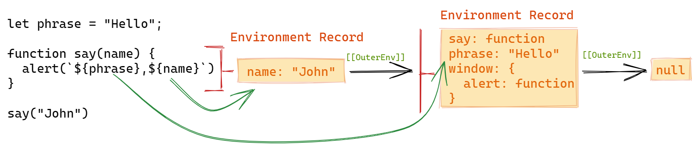

## 概括

本文主要是阐述了以下几个问题：
  - 作用域在规范中的定义 ❓
    - `Variable Object` 
    - `Lexical Environment` 
    - `Environment Record`
  - 作用域的作用 ❓
  - 作用域的确定 ❓
  - 作用域的划分 ❓
  - 参数是否会形成作用域 ❓
  - **实践：**确定全局对象。
- **作用域的确定与创建**与程序的执行有关，感兴趣可以阅读下一篇： [执行上下文](./Execution-Context.md)

**太长不看**👀：[总结](#总结)

### 作用域的定义

- ***作用域链***  是一系列用于解析标识符的对象。

  > **scope chain** is **a list of objects** that are searched when evaluating an Identifier.
  >
  > — [10.1.4 Scope Chain and Identifier Resolution (ES3, 1999)](https://www.ecma-international.org/publications/standards/Ecma-262-arch.htm).

- 从定义中可以看出，***作用域***  就是一个 **对象** ，***作用域链***  就是链接起来的对象；当程序运行时，会从作用域链中查找出相应的**标识符**的值。


:::info **作用域的本质**
可以发现，ECMAScript 规范并没有对 ***作用域***  给出具体的定义，只是表明它是一个对象，那么规范又是如何描述 ***作用域*** 这个概念的呢？👇
:::


如果你查看多个版本的 ECMAScript 规范文档或其它参考资料，你会发现 ***作用域***  有几种不同的描述，分别是：

  - `Variable Object` 
  - `Lexical Environment` 
  - `Environment Record`

**它们之间有什么区别吗？**👇


#### 👉 **Variable Object**

- 通过查阅规范可以得知，在 ES1~ES3 (1997, 1998, 1999) 的早期版本中，**作用域** 实际指的是 **_变量对象_** (Variable Object)。我们声明的 **变量** 会作为 **属性** 添加到 **_变量对象_**  上，**所以对变量的*增删改查*其实是对 _变量对象_ 的属性进行*增删改查***。

  > **Variables** and **functions** declared in the source text are added as properties of the **variable object**. For function code, **parameters** are added as properties of the variable object. — [10.1.3 Variable Instantiation (ES3, 1999)](https://www.ecma-international.org/publications/standards/Ecma-262-arch.htm).


#### 👉 Environment Record

- 从 ES5 (2009~2011) 开始，使用 `Environment Record` 来替代 ***变量对象*** 。
- 与 **_变量对象_** 中将变量作为属性不同，`Environment Record` 中存储的是 **绑定 (binding)**。
- **绑定 (binding)** 其实是键值对 (key-value)，可以使用 **绑定名 (bound name)** 对标识符进行相应的增删改查。


#### 👉 Lexical Environment

- `Lexical Environment` 与 `Environment Record` 本质上并无区别，所以在最新版 (ES2021) 的文档中直接使用 `Environment Record` 来描述 **作用域**，并使用其私有字段 `[[OuterEnv]]` 指向外部作用域。
  > A **Lexical Environment** consists of **an Environment Record** and **a possibly null reference** to an outer Lexical Environment.
  > — [8.1 Lexical Environments8.1.1 (ES11, 2020)](https://tc39.es/ecma262/#sec-executable-code-and-execution-contexts).

:::info 规范类型 (Specification Type)
  **Environment Record** 是规范中定义的一种类型，用于描述**_变量_** 的解析机制，由方法和私有字段组成，以下是其私有字段和部分方法：

  - `[[OuterEnv]]` 指向外部的 **Environment Record**。
  - `HasBinding(name)` 是否存在该名称的 **绑定**。
  - `DeleteBinding(name)` 删除指定名称的 **绑定**。
  - ...

:::


### 作用域的作用

根据定义可知作用域的主要作用是用于**解析标识符**；当需要查找某个**标识符(变量)**的值时：
  - 首先，在当前的作用域 (**Environment Record**) 中查找对应名称的绑定 (binding) 并返回其绑定值。
  - 如果在当前作用域中找不到，就通过 `[[OuterEnv]]` 查找其外部作用域，直到 `[[OuterEnv]]` 指向 `null` 为止
  - 示例如下：([以下图片的在线编辑地址](https://excalidraw.com/#json=4817240125865984,2mU0hYv24n_2Rq2Pb0sOJg))：




**规范文档中的相关描述：** [8.1.2.1 GetIdentifierReference (env, name, strict)]

1. If env is the value null, then
   - Return a value of type Reference whose base value component is undefined, whose referenced name component is name, and whose strict   reference flag is strict.
2. Let exists be ? **env.HasBinding(name)**.
3. If exists is true, then
   - Return a value of type Reference whose base value component is env, whose referenced name component is name, and whose strict reference flag is strict.
4. Else,
   - Let outer be **env.[[OuterEnv]]**.
   - Return ? GetIdentifierReference(outer, name, strict).


想要了解更详细的执行过程请查看：[binding 的获取与设置](https://www.yuque.com/docs/share/9b02197b-2494-46b1-8e6d-5c5c2e242005?#)


:::note **作用域的创建**
作用域用于解析标识符，所以作用域是代码执行时创建的？
:::


### 作用域的确定


**_作用域_** 除了用于对标识符求值之外，还具有以下特点：
  - ***作用域*** 是在声明或定义时就已经确定的，与代码的调用位置无关。
  - ***作用域*** 可以嵌套，内部作用域可以访问外部作用域，反之会报 `ReferenceError` 。
    > [闭包](./Closure.md) 的实现正是利用了 **作用域** 的这两个特点。

- **这样设计的目的：**
  - 隔离代码，避免命名冲突，遵守功能单一原则。
  - 减少代码执行时的内存消耗；
    - 如果所有的代码都保存在同一个作用域中可能会由于栈溢出而导致内存泄漏。
- 代码执行与**_作用域_** 的关系可以看下一篇 [执行上下文](./Execution-Context.md)。


:::tip **作用域链** 与 **原型链 (prototype)** 的区别
  **作用域链** 与 **原型链** (原型继承)之间有何异同？
:::

### 作用域的划分

从上节可知，程序执行时会从作用域中查找变量，下面让我们进一步了解不同代码所对应的作用域类型。

- **在 ES1~ES3 中，将作用域划分为以下三类：**
  - `global` 全局作用域。
  - `function` 函数作用域。
  - `eval(str)` 动态作用域。

- **ES5, ES5.1 (2009, 2011) 版本中，开始使用 `Environment Record` 描述作用域，分为以下三类：**
  - Declarative Environment Record.
  - Object Environment Record.
  - Global Environment Record.

- **从 ES6 (2015) 及以上版本开始，对作用域做了更细致的划分，总共分为以下五类：**

  1. `Declarative Environment Record`
      - 主要包括以下声明：var, let, const, class, import, module, function.
      - **注意：**如果 var 和 function 声明出现在顶级作用域中，则会作为属性添加到全局对象上 (全局对象属于 Object Environment Record 👇)。
      > Each declarative Environment Record is associated with an ECMAScript program scope containing **variable, constant,let, class, module,      import, and/or function** declarations. — [8.1.1.1  Declarative Environment Records (ES11, 2020)](https://tc39.es/ecma262/#sec-declarative-environment-records)

    ```js title="Declarative Environment Record 模拟" {13-21}
    /* utils.js
      exports const count = 0;
    */

    import {count} from 'utils.js'
    var a = 1;
    let b = 2;
    const c = 3;
    function foo() {};
    class bzr {}

    // 模拟 Environment Record 中保存的 binding。
      Declarative Environment Record {
        count: 0,    // bingding
        a: 1,        // bingding
        b: 2,        // bingding
        c: 3,        // bingding
        foo: f(),    // bingding
        bar: class,  // bingding
      }

    ```


  2. `Function Environment Record`
      - 主要包括以下声明：`[async, generator, arrow] function`
      - 保存函数体中***顶级作用域*** 的所有声明。
        > **A function Environment Record** is a declarative Environment Record that is used to represent **the top-level scope** of a function and, if the function is not an Arrow Function, provides a `this` binding. 
        > 
        > — [8.1.1.3  Function Environment Records (ES11, 2020)](https://tc39.es/ecma262/#sec-function-environment-records) 
      - **函数的参数会形成作用域吗？**分为以下两种情况：
        1. 如果参数具有默认值，则参数会单独形成一个作用域，而函数体会形成另一个作用域。
        2. 如果参数不具有默认值，则参数与函数体的顶层作用域中声明的变量将被保存在同一个 `Environment Record` 对象中。

          > When an execution context is established for evaluating an ECMAScript function a new function Environment Record is created and bindings for each formal parameter are instantiated in that Environment Record. Each declaration in the function body is also instantiated. 
          > 
          > If the function's formal parameters do not include any default value initializers then the body declarations are instantiated in the same Environment Record as the parameters. 
          > 
          > If default value parameter initializers exist, **a second Environment Record** is created for the body declarations. Formal parameters and functions are initialized as part of Function Declaration Instantiation. All other bindings are initialized during evaluation of the function body.
          >
          > [— 9.2.10 FunctionDeclarationInstantiation(func, argumentsList) (ES11, 2020).](https://tc39.es/ecma262/#sec-functiondeclarationinstantiation)

          > 27.If hasParameterExpressions is false, then ...
          >
          > 28.Else, 
          >
          > NOTE: **A separate Environment Record** is needed to ensure that closures created by expressions in the formal parameter list do not have visibility of declarations in the function body.
          >
          > [— 9.2.10 FunctionDeclarationInstantiation(func, argumentsList) (ES11, 2020).](https://tc39.es/ecma262/#sec-functiondeclarationinstantiation)


  3. `Object Environment Record`
      - `with(someObj) {}` 语句。
      - **someObj** 对象中 **属性与值之间的映射(key-value pair)** 会作为 **绑定(binding)** 保存在 **Object Environment Record** 作用域中，所以可以直接访问对象的属性。

        ```jsx {10-15}
        with(console) {
          const msg = `
            因为 Object Environment Record 中保存着对象相关属性的 binding，
            所以可以直接使用 log() ，而不是 console.log();
          `;
          log(msg);
        }

        // 模拟 Environemnt Record 中存储的 bingding.
          Object Environment Record
          {
            log: f() {},  // bingding
            dir: f() {},  // binding 
          }
        ```


  4. `Module Environment Record`
     - 模块内声明的变量（标识符）。
       ```js
        (() => {
          const count = 0; // Module Environment Record
        })()
       ```
     


  5. `Global Environment Record`
      - **JavaScript 语言自身定义的对象和属性。**
        - Infinite, isNaN, Regexp, Array, Date, JSON, ...。
      - **与运行环境相关的全局对象。**
        - window, global, self, ...。
      - **顶级作用域中的声明的所有变量 (script 文件) 。**
        - var, function, let, const, ...。
        - **注意：**var 和 function 声明会作为属性添加到全局对象上。
      - **隐式创建的全局变量，如：**
        - `if(true) {var a = 1;}` 
      - **规范中的定义:**
        > **A global Environment Record** provides the bindings for built-in globals (clause [18](https://tc39.es/ecma262/#sec-global-object)), properties of the **global object**, and for all **top-level declarations** ([13.2.8](https://tc39.es/ecma262/#sec-block-static-semantics-toplevellexicallyscopeddeclarations), [13.2.10](https://tc39.es/ecma262/#sec-block-static-semantics-toplevelvarscopeddeclarations)) that occur within **a Script**.


:::info 作用域的层级体系
可以看出，**Global Enviroment Record** 实际上由以下两类作用域组成：
  - `Object Enviroment Record`
  - `Declarative Enviroment Record` 
  
而 **Declarative Environment Record** 则包含以下两类作用域：
  - `Module Environment Record`
  - `Function Environment Record`

事实上，作用域虽然划分为五类，但它们之间是包含关系，作用域实际上只保存在两个字段中(规范层面)，更多信息请查看一下篇：[执行上下文](Execution-Context.md)。
  > [8.1.1 The Environment Record Type Hierarchy (ES11, 2020)](https://tc39.es/ecma262/#sec-the-environment-record-type-hierarchy)
:::


### 练习：确定全局对象📝

<details>
  <summary>点击展开</summary>

  ```js
  const theGlobalScopeObject =
  (typeof globalThis != "undefined") ? globalThis :
  (typeof global != "undefined") ? global :
  (typeof window != "undefined") ? window :
  (typeof self != "undefined") ? self :
  (new Function("return this"))();
  ```
</details>


## 总结


## 参考

  > [JavaScript深入之变量对象 — 羽牙](https://github.com/mqyqingfeng/Blog/issues/5)
  >
  > [Variable scope — javascript.info](https://javascript.info/closure)
  >
  > ["Scope & Closures" — You Dont Know JS](https://github.com/getify/You-Dont-Know-JS/blob/2nd-ed/scope-closures/README.md)
  >
  > [ECMAScript 2021 Language Specification](https://tc39.es/ecma262/)
  >
  > [Scope chain — ECMA-262-3 in detail. Chapter 4.](http://dmitrysoshnikov.com/ecmascript/chapter-4-scope-chain/#scope-features)
  >
  > [A detailed look at global variables — exploringjs (推荐)](http://dmitrysoshnikov.com/ecmascript/chapter-4-scope-chain/#scope-features)


## 拓展

:::info 如何阅读规范文档

  如果第一次阅读 ECMAScript 标准，可能会感觉无从下手，可以先阅读以下介绍文章：

  - [How to Read the ECMAScript Specification ?](https://timothygu.me/es-howto/)
  - [Understanding the ECMAScript spec  — V8 Blog.](https://v8.dev/blog/tags/understanding-ecmascript)

:::


