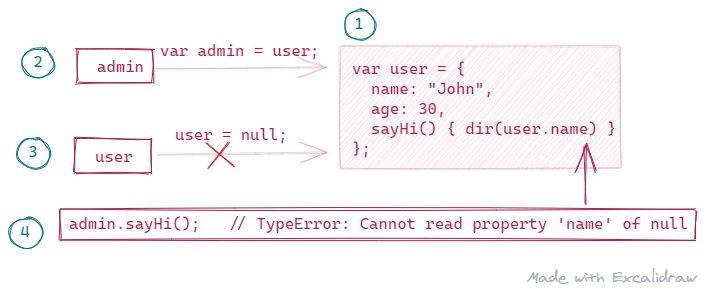

## 概括

  - `this` 有什么作用 ❓
  - `this` 何时确定，如何确定 ❓
  - 如何解决 `this` 丢失问题 ❓
  - **实践：**call, apply, bind 的实现。✍
  - **挑战：** 如何判断 javascript 代码是否可调用？

**太长不看**👀：[总结](#总结)

### `this` 的定义

`this` 其实是 **对象的引用** ，使 **对象** 与 **函数(方法)** 产生关联。

- `this` 值被保存在作用域的以下插槽中：
  - 函数作用域的 `[[ThisValue]]` 插槽。
  - 全局作用域的 `[[GlobalThisValue]]` 插槽。
- 执行函数时，根据需要从作用域中获取相应的 `this` 值。
- **注意：**绑定 `this` 值时，非严格模式会对 `this` 值进行相应的转换。

#### 非严格模式

- `Object` 类型不进行转换。
- `null` 和 `undefined` 替换为全局对象。
- `String` `Number` `Boolean` `Bigint` `Sumbol` 等基本类型会自动转换为对象类型。

```js
function foo() {
  console.log(this);
}

// 未绑定调用对象时 this 为全局对象
foo(); // window

// 调用对象为 null 或 undefined 时会被忽略，即相当于未绑定调用对象
foo.call(null);       // window
foo.call(undefined);  // window

// 调用对象为值类型 (primitive) 时会被转换为引用类型
foo.call(1);               // {1}
foo.call(false);           // {false}
foo.call("Mike");          // {'Mike'}
foo.call(BigInt(1));       // {1n}
foo.call(Symbol("Lisa"));  // {Symbol(Lisa)}

//引用类型直接返回
foo.call({ name: "John" }); // {name: 'John'}
```

#### 严格模式

```js
function foo() {
  "use strict";
  console.log(this);
}

// 值类型与引用类型都是直接返回绑定对象，无绑定对象时返回 undefined
foo(); // undefined
foo.call(null); // null
foo.call(undefined); // undefined
foo.call(1); // 1
foo.call(false); // false
foo.call("Mike"); // 'Mike'
foo.call(BigInt(1)); // 1n
foo.call(Symbol("Lisa")); // Symbol(Lisa)
foo.call({ name: "John" }); // {name: 'John'}
```

### `this` 的作用

`this` 的作用主要包括以下几个方面：

- 传递引用；
- 链式调用；
- 方法借用；
- 事件处理；
- 回调函数；
- 构造函数；
- `getter` `setter`

#### `this` 与变量的引用传递

```js 4
var user = {
  name: "John",
  age: 30,
  sayHi() {
    dir(user.name);
  }, // 该方法依赖于 user 对象，使用 this 时不存在该限制
};

var admin = user; // 两个对象引用同一块内存地址
user = null; // 删除一个引用

admin.sayHi(); // TypeError: Cannot read property 'name' of null
```



#### 链式调用

```js {5,9,13}
let ladder = {
  step: 0,
  up() {
    this.step++;
    return this;
  },
  down() {
    this.step--;
    return this;
  },
  showStep() {
    alert(this.step);
    return this;
  },
};

ladder.up().up().down().up().down().showStep(); // 1
```

#### 对象之间的方法借用

对象与方法之间并不存在绑定关系，所以方法可以轻易的在对象之间共享。

```js
var user1 = {
  name: "John",
  age: 18,
  logThis: function () {
    dir(this);
  },
  sayName: function () {
    dir(this.name);
  },
};

var user2 = {
  name: "Mike",
  age: 14,
  sayAge: function () {
    dir(this.age);
  },
};

// this 的取值与声明的位置无关，与调用的对象有关
user1.sayName(); // John
user1.sayName.call(user2); // Mike
user2.sayAge(); // 14
user2.sayAge.apply(user1); // 18
```

#### `getter` and `setter`

```js
function sum() {
  return this.a + this.b + this.c;
}

var o = {
  a: 1,
  b: 2,
  c: 3,
  get average() {
    return (this.a + this.b + this.c) / 3;
  },
};

Object.defineProperty(o, "sum", {
  get: sum,
  enumerable: true,
  configurable: true,
});

console.log(o.average, o.sum); // 2, 6
```

### `this` 的确定

如果方法不与对象绑定，那么如何以及何时确认 `this` 的取值？

实际上，`this` 值是在 **执行函数** 时确定的，其取值与函数的类型和调用方式有关，主要分为以下三类：

- 普通函数：调用函数的对象；
- 构造函数：构造函数创建的对象(使用 `new` 运算符)。
- 箭头函数：外部作用域的 `this` 值。

#### 函数调用方式对 `this` 的影响

```js
var user = {
  name: "Lisa",
  sayHi() {
    console.log(this);
  },
};

user.sayHi(); // {name: 'Lisa', sayHi: f}

var sayHi = user.sayHi;
sayHi(); // window (browser)
```

`this` 值的确定过程：

- 具有调用对象时，`this` 值为该对象。
- 不具有调用对象时：
  - 非严格模式为全局对象 (window, global, ...)；
  - 严格模式为 `undefined`，或者通过其它方式 (call, apply, ...) 绑定的 `this` 值。

#### 绑定函数 (bound function)

```js
function foo() {
  function bar() {
    console.log(this); // window (browser),严格模式下为 undefined
  }

  bar(); // 由于 bar 未绑定其它对象，所以该函数的 this 值为全局对象或 undefined
  console.log(this); // {name: 'Lisa'}
}

foo.call({ name: "Lisa" }); // 将 foo 的 `this` 值绑定为该对象 {name: 'Lisa'}
```

从示例中可以看出，`this` 的取值与其 **位置** 无关，如：

- 不会因为是对象的方法就永远与该对象绑定。
- 绑定函数 (bound function) 中内部函数的取值与外部函数不同。

`this` 取值与函数调用有关，与对象方法，嵌套函数等无关。

### `this` 的原理 ✨

主要分为以下两部分：

- **编译阶段**，实例化函数定义(声明)，包括设置原型、内部插槽等。

  - 该阶段会确定函数的运行模式并记录在 `[[ThisMode]]` 内部插槽中。
  - 主要分为以下三种模式：

    - `lexical` 箭头函数，值为外部作用域的 `this` 值。
    - `strict` 严格模式，除 `null` 以外的其它类型的值。
    - `global` 非严格模式，值为全局对象。

> — [14.1.23 Runtime Semantics: InstantiateFunctionObject (ES12, 2021)](https://tc39.es/ecma262/#sec-function-definitions-runtime-semantics-instantiatefunctionobject)

- **执行阶段**：解析 **成员表达式(MemberExpression)** 并获取包含调用对象信息的 `Reference Type` 类型值。

  - 该类型主要由以下三部分组成：
    - `name` 属性名。
    - `strict` 是否为严格模式。
    - `base` 调用对象，值可以为以下类型：undefined, Object, Boolean, String, Symbol, Number, BigInt, Environment Record.
  - `MemberExpression` 中与函数调用相关的表达式主要有以下几种：

    - `func`
    - `obj.func`
    - `obj[func]`
    - `method().identifier`
    - `method()()`
    - `new func`
    - `super.identifier`
    - `super.method`
    - 全部成员表达式请查看规范文档：

      > [12.3 Left-Hand-Side Expressions (ES12, 2021)](https://read262.netlify.app/ecmascript-language-expressions/left-hand-side-expressions)

    - 例如 `foo()` 中的成员表达式为 `foo`，执行该表达式会返回 `Reference Type` 类型值，该值会用于随后的函数调用。`foo` 标识符的解析过程可以查看规范中的以下章节：

      > [12.1.6 Runtime Semantics: Evaluation -- Identifies (ES12, 2021)](https://tc39.es/ecma262/#sec-identifiers-runtime-semantics-evaluation)

    - `obj.foo()` `obj[foo]()` 的成员表达式为 `obj.foo`, `obj.[foo]`，可以查看规范中的属性访问器章节：
      > [12.3.2 Property Accessors (ES12, 2021)](https://tc39.es/ecma262/#sec-property-accessors)

  - 使用获取到的 `Reference Type` 执行函数：

    > [12.3.6.2Runtime Semantics: EvaluateCall (func, ref, arguments, tailPosition)](https://read262.netlify.app/ecmascript-language-expressions/left-hand-side-expressions#sec-evaluatecall)

  - 执行**函数体**之前会先设置 `this` 的值，设置过程如下：

    > Let thisMode be **F.[[ThisMode]]**.
    >
    > If thisMode is **lexical**, return NormalCompletion(undefined).
    >
    > Let calleeRealm be F.[[Realm]].
    >
    > Let localEnv be the LexicalEnvironment of calleeContext.
    >
    > If thisMode is **strict**, let thisValue be thisArgument.
    >
    > Else,
    >
    > - If thisArgument is **undefined** or **null**, then
    >
    >   - Let globalEnv be calleeRealm.[[GlobalEnv]].
    >
    >   - Assert: globalEnv is a global Environment Record.
    >
    >   - Let thisValue be **globalEnv.[[GlobalThisValue]]**.
    >
    > - Else,
    >
    >   - Let thisValue be ! ToObject(thisArgument).
    >
    >   - NOTE: ToObject produces wrapper objects using calleeRealm.
    >
    > Assert: localEnv is a function Environment Record.
    >
    > Assert: The next step never returns an abrupt completion because localEnv.[[ThisBindingStatus]] is not initialized.
    >
    > Return **localEnv.BindThisValue(thisValue)**.
    >
    > — [9.2.1.2 OrdinaryCallBindThis(F, calleeContext, thisArgument) (ES12, 2021)](https://tc39.es/ecma262/#sec-ordinarycallbindthis)
    >
    > — [12.3.6 Function Calls (ES12, 2021)](https://tc39.es/ecma262/#sec-function-calls)

    > function that is the value of a property.When a function is called as a method of an object, the **object** is passed to the function as its **this** value.
    >
    > [4.4.37 method (ES12, 2021)]

### `this` 的绑定

主要包括以下几种方法：

- 类字段
- 箭头函数
- `call` `apply` `bind`
- `Array.from(items [ , mapfn [ , thisArg]])`
- `Array.prototype.every(callbackfn [ , thisArg ])`
- `Array.prototype.forEach (callbackfn [ , thisArg ])`
- ...

#### `call` and `apply`

如果想要指定执行函数时的 `this` 的值，可以使用以下方法：

- `Function.prototype.call (thisArg, ...args)`
- `Function.prototype.apply(thisArg, argArray)`

```js
function foo(a, b) {
  if (this.operator === "+") return a + b;
  if (this.operator === "*") return a * b;
  return undefined;
}
foo(); // undefined
foo.call({ operator: "+" }, 1, 2); // 3
foo.apply({ operator: "*" }, [1, 2]); // 2
```

#### `bind`

如果想要函数与对象永远绑定且不可更改返回的绑定函数，可以使用以下方法：

- `Function.prototype.bind(thisArg, ...args)`

```js
function foo(a, b) {
  if (this.operator === "+") return a + b;
  if (this.operator === "*") return a * b;
  return undefined;
}

var foo1 = foo.bind({ operator: "+" }, 1, 2);
var foo2 = foo1.bind({ operator: "*" }, 3, 4);
foo(); // undefined
foo1(); // 3
foo2(); // 3
```

#### 箭头函数

使用箭头函数获取外部作用域的 `this` 值。

```js
// 常规函数
function foo() {
  setTimeout(function () {
    console.log(this.a + this.b);
  }, 100);
}
foo.call({ a: 1, b: 2 }); // NaN

// 箭头函数
function foo() {
  setTimeout(() => {
    console.log(this.a + this.b);
  }, 100);
}
foo.call({ a: 1, b: 2 }); // 3
```

#### Array 原型中包含 `thisArg` 参数的方法

```js
var myself = {
  myName: "Manoj",
  myNickNames: ["Minko", "BMK"],
  printMyNickNames: function () {
    "use strict";
    this.myNickNames.forEach(function (nickName) {
      console.log(this.myName + " is also known as " + nickName);
    }, this); // thisArg
  },
};

myself.printMyNickNames();
```

代码来源于：[Functions inside methods and this variable](https://github.com/bmkmanoj/js-by-examples/blob/master/examples/functions_inside_methods_and_this_variable.md#functions-inside-methods-and-this-variable)

#### 构造函数

**this 未绑定：**

```js
class Bar {
  constructor(name) {
    this.name = name;
  }

  // sayHi 与 this 并未绑定
  sayHi() {
    console.log(this.name);
  }
}

var bar = new Bar("Lisa");
bar.sayHi(); // Lisa

var sayHi = bar.sayHi;
sayHi(); // TypeError: Cannot read property 'name' of undefined

// TypeError: Class constructor Bar cannot be invoked without 'new'
var baz = Bar("Mike");
```

**在构造函数中绑定 this**

```js
class Foo {
  constructor(name) {
    this.name = name;
    this.sayHi = this.sayHi.bind(this); // 绑定 this
  }

  sayHi() {
    console.log(this.name);
  }
}

var foo = new Foo("John");
foo.sayHi(); // John

foo.sayHi.call({ name: "LiMei" }); // John，bind 只能绑定一次

foo1();
var sayHi = foo.sayHi;
sayHi(); // John，绑定 this 后再也不怕 this 丢失了
```

子类 (derive class) 的 `this` 值由父类创建，需要在子类的构造函数 (**constructor**) 和方法中调用 `super` 来获取父类创建的 `this` 值并继承父类的实例属性和原型属性。**注意：**子类只有调用 `super` 才能获取到 `this` 值，子类本身并不创建 `this`。更详细的解析请参考我上一篇文章：[继承、new、super](./Inheritance.md)。

**使用箭头函数获取构造函数中的 this 值**

```js
function Foo(name) {
  this.name = name;

  // 普通函数不会绑定外部作用域中的 this
  this.sayThis = function () {
    console.log(this);
  };

  // 箭头函数可以获取外部作用域中 this
  this.sayName = () => {
    console.log(this.name);
  };
}

var foo = new Foo("LiMei");

var sayName = foo.sayName;
sayName(); // 14
foo.sayName(); // 14

var sayThis = foo.sayThis;
sayThis(); // window
foo.sayThis(); // Foo
```

#### 类字段

```js
class Foo {
  constructor(name) {
    this.name = name;
  }

  sayName = () => {
    console.log(this.name);
  };
}

var foo = new Foo("LiLi");

sayName = foo.sayName;
sayName(); // LiLi
foo.sayName(); // LiLi
```

### `apply` `call` 的实现

#### `call`

ECMAScript 中的定义：[19.2.3.3 Function.prototype.call (thisArg, ...args)]

1. Let func be the **this** value.
2. If [IsCallable(func)](https://read262.netlify.app/abstract-operations/testing-and-comparison-operations#sec-iscallable) is false, throw a **TypeError** exception.
3. Perform [PrepareForTailCall()](https://read262.netlify.app/ecmascript-language-functions-and-classes/tail-position-calls#sec-preparefortailcall).
4. Return [?Call(func, thisArg, args)](https://read262.netlify.app/abstract-operations/operations-on-objects#sec-call).

> NOTE 1
> The **thisArg** value is passed without modification as the this value. This is a change from Edition 3, where an **undefined** or **null** thisArg is replaced with the [global object](https://read262.netlify.app/global-object) and [ToObject](https://read262.netlify.app/abstract-operations/type-conversion#sec-toobject) is applied to all other values and that result is passed as the this value. Even though the **thisArg** is passed without modification, non-strict functions still perform these transformations upon entry to the function.
>
> NOTE 2
> If func is **an arrow function** or **a bound function exotic object** then the thisArg will be ignored by the function [[Call]] in step 4.

**示例 1：严格模式**

```js
Function.prototype.callCopy = function (thisArg) {
  // 判断 this 是否可调用 (is callable)
  if (typeof this !== "function")
    throw new TypeError(this + ".call is not a function");

  // 判断 thisArg 是否为对象
  var type = typeof thisArg;
  if (type !== "object" || thisArg === null) {
    throw new TypeError(
      "Cannot call function on " + type + " " + thisArg + "."
    );
  }

  // 参数
  var args = [];
  for (let i = 1; i < arguments.length; i++) {
    args[args.length] = arguments[i];
  }

  // 生成一个用于保存调用函数的键
  var callFunc = Symbol("callFunc");

  thisArg[callFunc] = this;
  var result = eval("thisArg.callFunc(" + args + ")");
  delete thisArg.callFunc;
  return result;
};
```

**示例 2：非严格模式**

```js
// 全局对象
const GlobalObject =
  typeof globalThis != "undefined"
    ? globalThis
    : typeof global != "undefined"
    ? global
    : typeof window != "undefined"
    ? window
    : typeof self != "undefined"
    ? self
    : new Function("return this")();

Function.prototype.callCopy = function (thisArg) {
  // null 和 undefined 替换为全局对象
  if (thisArg === null || thisArg === undefined) thisArg = GlobalObject;

  // 基本类型 (primitive type) 根据 toObject 规则转换为对象类型
  if (typeof thisArg !== "object") thisArg = Object(thisArg);
};
```

从定义和示例可以看出，`call` 的实现大概需要注意以下几点：

- 判断调用函数是否可调用，可以使用 [is-callable](https://github.com/inspect-js/is-callable) 库进行判断。
- 判断指定的 `thisArg` 值是否为对象类型，且根据调用模式对其进行相应的转换：
  - 严格模式：仅可以使用对象类型调用。
  - 非严格模式：
    - `Object` 类型不用转换。
    - `null` 或 `undefined` 类型替换为全局对象。
    - `String` `Number` `Boolean` `Symbol` `BigInt` 等基本类型 (primitive value) 使用 `toObject` 转换为对象类型。
- 通过 `arguments` 将参数存储到数组 `args` 中。
- 创建一个用于保存调用函数的唯一键，可以通过以下方式：
  - `Math.random`
  - `Date.now`
  - `Symbol`
  - [uuid](https://github.com/uuidjs/uuid)
- 通过 `this` 关键字将调用函数添加到调用对象上：`thisArg[uniqueKey] = this`
- 利用 `eval` 执行函数，参数数组 `args` 会自动解析为以逗号分隔的参数。
- 删除添加到调用对象上的函数。
- 返回执行结果。

#### `apply`

**apply** 与 **call** 的实现原理基本相同，参数直接使用 `arguments[1]` 获取即可。

### `bind` 的特性与实现

与 `apply` 和 `call` 根据指定的 `this` 值直接调用函数不同，`bind` 返回一个绑定指定 `this` 值的函数，该函数也称为**绑定函数 (bound function)**。除此之外，`bind` 还具有以下特性：

- 绑定函数可以作为**构造函数**使用，创建的实例时会使用自动生成的 `this` 值替换绑定的 `this` 值。
- 如果调用的函数具有原型 (**prototype**) 属性，绑定函数会继承该函数的原型属性。
- 绑定函数再次绑定 `this` 值不会生效，`this` 值仍然为第一次绑定的值。
- 虽然绑定函数不可以再次绑定 `this` 值，但可以继续绑定参数，可用于实现部分 (**partial**) 函数。

```js
Function.prototype.bindCopy = function (boundThis) {
  // 判断是否可调用
  if (typeof this !== "function")
    throw new TypeError("this is not a function.");

  // 调用函数
  var callFunc = this;

  // 绑定的参数
  var slice = Array.prototype.slice;
  var boundArgs = slice.call(arguments, 1);

  // 保存绑定的参数长度
  var boundArgsLength = boundArgs.length;

  // 空的构造函数，用于继承调用函数的原型属性
  function F() {}

  function boundFunction() {
    // 绑定的参数不变，再加上每次调用时的参数
    boundArgs.length = boundArgsLength;
    boundArgs.push.apply(boundArgs, arguments);

    // 创建实例时使用自动生成的 this 值替换绑定的 this 值
    var instOrBoundThis = this instanceof F ? this : boundThis;

    // 值用指定的 this 值和参数调用保存的调用函数
    return callFunc.apply(instOrBoundThis, boundArgs);
  }

  // 如果调用函数拥有 prototype 属性，则继承该属性
  if (callFunc.prototype) F.prototype = callFunc.prototype;

  // 利用 new 运算符继承调用函数的原型属性
  boundFunction.prototype = new F();

  // 返回绑定函数
  return boundFunction;
};
```

#### 示例 1：将 _绑定函数_ 作为 _构造函数_ 使用

```js
// 函数
function Point(x, y) {
  this.x = x;
  this.y = y;
  if (this.x && this.y) this.sum = this.x + this.y;
  console.log(this);
}

var BoundFunction = Point.bindCopy({ sum: 0 });
BoundFunction(); // {sum: 0, x: undefined, y: undefined}

// 将绑定函数作为构造函数使用
var point1 = new BoundFunction(3, 4); // {sum: 7, x: 3, y: 4}
var point2 = new BoundFunction(5, 6); // {sum: 11, x: 5, y: 6}
```

`new BoundFunction` 的执行过程如下：

- 执行 `new` 运算符时，会创建一个新对象，并将该对象赋值给当前作用域的 [[ThisValue]] 插槽。
- 此时的 `this` 值为 `[[ThisValue]]` 插槽中的值，并不是绑定值 `{sum: 0}`。
- 调用绑定的参数 `callFunc.apply(instOrBoundThis, args)` 并返回执行结果。

```js
function boundFunction() {
  // 更改 length 长度，将参数恢复为绑定函数生成时的参数
  boundArgs.length = boundArgsLength;          // []

  // 添加本次调用接收的参数
  boundArgs.push.apply(boundArgs, arguments);  // [3,4]

  // this 值为新创建的对象，而不是此前绑定的 {sum: 0}
  var instOrBoundThis = (this instanceof F) ? this : boundThis;

  // 使用 this 值和相应的参数调用绑定的函数
  return callFunc.apply(instOrBoundThis, boundArgs);

  // point = {sum: 7, x: 3, y: 4}
  var point1 = (Point(x, y) {
    this.x = x;  // this.x = 3;
    this.y = y;  // this.y = 4;
    if(this.x && this.y) this.sum = this.x + this.y // this.sum = 3 + 4 = 7
    console.log(this)  // {sum: 7, x: 3, y: 4}
    return this;
  })();
}
```

#### 示例 2：_绑定函数_ 继承 _调用函数_ 的原型属性

```js
// 调用函数
function Point(x, y) {
  this.x = x;
  this.y = y;
}

// 原型方法
Point.prototype.toString = function () {
  return `${this.x},${this.y}`;
};

// 绑定函数 的原型属性继承 调用函数 的原型属性
// BoundFunction.prototype.__proto__ = Point.prototype
var BoundFunction = Point.bindCopy(null);

// 利用 new 运算符继承绑定函数的原型属性
// point.__proto__ = BoundFunction.prototype
var point = new BoundFunction(1, 2);

// 调用原型中的方法
point.toString(); // 1,2
```

#### 示例 3：_绑定函数_ 再次绑定 this 值不会生效，但参数可以增加

```js
function Point(x, y) {
  this.x = x;
  this.y = y;
  console.log(this, Array.from(arguments));
}

var BoundFunction1 = Point.bindCopy({ z: 3 }, 1, 2);
BoundFunction1(); // {z: 3, x: 1, y: 2} [1,2]

// 绑定函数 BoundFunction1 再次绑定 {z: 4}，并传入参数 5, 6
var BoundFunction2 = BoundFunction1.bindCopy({ z: 4 }, 5, 6);
BoundFunction2(); // {z: 3, x: 1, y: 2} [1,2,5,6]
```

#### 示例 4：拥有实现部分 (patial) 函数

```js
function Point(x, y) {
  this.x = x;
  this.y = y;
  console.log(this.x + this.y);
}

var BoundFunction = Point.bindCopy(null, 1);

BoundFunction(2); // 3
BoundFunction(3); // 4
BoundFunction(4); // 5
```

### 巩固练习 📝

#### 严格模式与非严格模式

```js
function makeUser() {
  return {
    name: "John",
    ref: this,
  };
}

let user = makeUser();

console.log(user.ref.name); // ?
```

#### 语句与表达式

<details>
  <summary>提示</summary>

自动插入分号的规则 (Auto Semicolon Insert)。

</details>

```js
let user = {
  name: "John",
  go: function () {
    alert(this.name);
  },
}(user.go)(); // ?
```

## 总结

- **`this` 的作用：**
  - 共享其它对象的函数属性(方法)，因为 `this` 只与调用对象有关，与声明的位置无关。
  - 方法之间的链式调用，通过返回 `this` 来获取上一个方法的执行结果。
  - 事件处理函数中通过 `this` 获取触发的事件。
  - 构造函数中通过 `this` 初始化实例。
- **`this` 何时创建？**
  - 函数调用时创建与确定，主要分为以下三类：
    - 普通函数：调用函数的对象；
    - 构造函数：构造函数创建的对象(使用 `new` 运算符)。
    - 箭头函数：外部作用域的 `this` 值。
- **`this` 的确定：**
  - 具有调用对象时，`this` 值为该对象。
  - 不具有调用对象时：
    - 非严格模式为全局对象 (window, global, ...)；
    - 严格模式为 `undefined`，或者通过其它方式 (call, apply, ...) 绑定的 `this` 值。
- **如何设定预期的 `this` 值？**
  - 类字段。
  - 箭头函数。
  - `call` `apply` `bind`
  - 具有 `thisArg` 参数的数组的原型方法，如：
    - `Array.from(items [ , mapfn [ , thisArg]])`
    - `Array.prototype.every(callbackfn [ , thisArg ])`
- `call` `apply` `bind` 的实现：
  - 通过 `this` 获取到调用的函数，将该函数添加到指定的对象上，使用该对象调用该函数。
  - 需要注意以下几点：
    - 判断获取的 `this` 值是否可调用。
    - 判断指定的对象是否为对象，根据是否为严格模式对象进行相应的转换。
    - 调用后从对象上删除该函数。

## 参考

- `this`

  > [this -- MDN](https://developer.mozilla.org/en-US/docs/Web/JavaScript/Reference/Operators/this)
  >
  > [Reference Type --javascript.info](https://javascript.info/reference-type)
  >
  > [Object methods, "this" -- javascript.info](https://javascript.info/object-methods#tasks)
  >
  > [A different way of understanding this in JavaScript -- 2ality](https://2ality.com/2017/12/alternate-this.html)
  >
  > [JavaScript’s this: how it works, where it can trip you up -- 2ality](https://2ality.com/2014/05/this.html)

- `call` `apply` `bind`
  > [How to Generate Unique ID in JavaScript](https://dev.to/rahmanfadhil/how-to-generate-unique-id-in-javascript-1b13)
